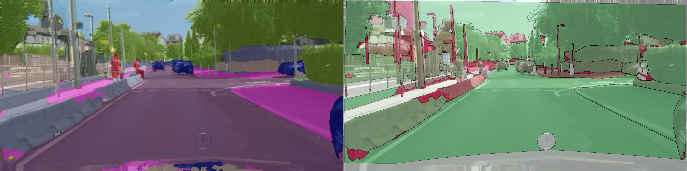
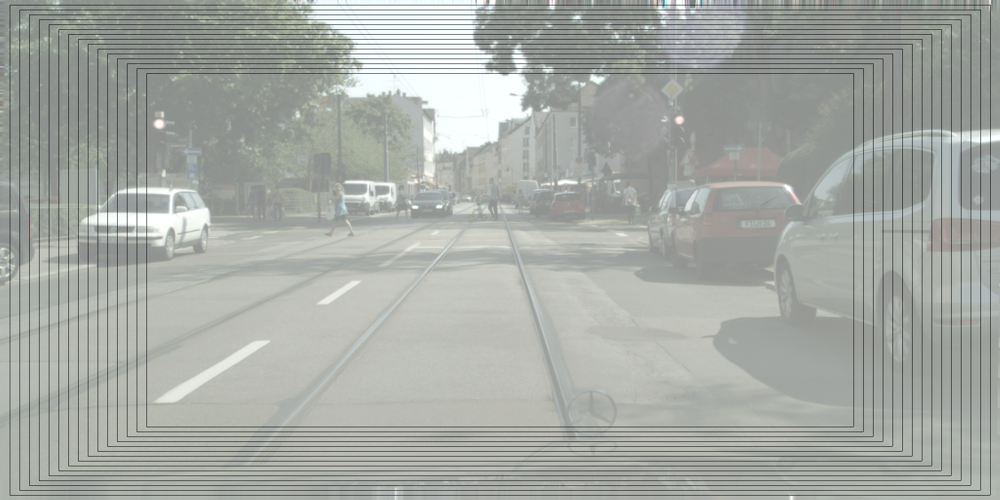

## What is MetaSeg:

MetaSeg is a post-processing tool for semantic segmentation neural networks. For each component/object in the segmentation, MetaSeg on one hand provides a method that predicts whether this particular component intersects with the ground truth or not. This task can be understood as meta classifying between the two classes {IoU=0} and {IoU>0} segment-wise. On the other hand MetaSeg also provides a method for quantifying the uncertainty/confidence for each predicted segment by predicting IoU values via regression. MetaSeg is a method that treats the neural network like a black box, i.e., at inference time it only uses the softmax output of the neural network. For further information we refer to http://arxiv.org/abs/1811.00648.

#### Nested MetaSeg Branch

This branch of MetaSeg uses nested crops with a common center point for each input image, resizes all crops to the same size and uses a tensorflow neural network of your choice to obtain a prediction for the whole batch of crops. These predictions are then resized to the corresponding original crop size and thus yield an ensemble of predictions for each cropped image. We then investigate ensembles of uncertainty heat maps as well as their mean and standard deviations. From this we obtain additional heat maps. Furthermore we include additional metrics as well as neural networks for the meta classification and regression tasks. For further reading and also in case you want to re-use the code and publish results, please refer to http://arxiv.org/abs/XXXXXXX

## Preparation:

We assume that the user is already using a neural network for semantic segmentation and a corresponding dataset. 

For inferring the different probability distributions for each crops and merging them to a common probability distribution, the script "nested_probs.sh" can be used. It also provides all heat maps that can be used in MetaSeg later. It is prepared to be used with a Deeplabv3+ Mobilenetv2 network on the Cityscapes dataset (see next section).

For each image from the segmentation dataset, MetaSeg requires an hdf5 file that contains the following data:

* a three-dimensional numpy array (image dimensions times number of classes that the segmentation network can predict) that contains the softmax probabilities computed for the current image, data type float
* the filename of the current input image
* a two-dimensional numpy array (of input image dimension) that contains the ground truth class indices for the current image
* pickle files with heat maps generated by "nested_probs.sh"

MetaSeg provides a function "probs_gt_save" in "metaseg_io.py" to store this information for each image. Before running MetaSeg, please edit all necessary paths stored in "global_defs.py". You can overwrite your default settings stored in "global_defs.py" temporarily by setting command line arguments in "metaseg_eval.sh", this script can be used for running MetaSeg. MetaSeg is CPU based and parts of MetaSeg trivially parallelize over the number of input images, adjust "NUM_CORES" in "global_defs.py" or "metaseg_eval.sh" to make use of this.

## Deeplabv3+ and Cityscapes:

The results in http://arxiv.org/XXXXXXX have been obtained from the Deeplabv3+ Mobilenetv2 network (https://github.com/tensorflow/models/tree/master/research/deeplab) together with the Cityscapes dataset (https://www.cityscapes-dataset.com/). For using the latter you need to enroll at Cityscapes on the website. For details on using Deeplabv3+ networks in combination with Cityscapes, we refer to the README page https://github.com/tensorflow/models/blob/master/research/deeplab/g3doc/cityscapes.md.

When you have downloaded deeplab, adjust the deeplab path in "global_defs.py", adjust all other paths, run "nested_probs.sh" and then run "metaseg_eval.sh".

## Packages and their version we used:

* tensorflow-gpu==1.9.0
* pandas==0.22.0
* scikit-learn==0.19.0
* Pillow==4.2.1
* matplotlib==2.0.2
* scipy==0.19.1
* h5py==2.7.0
* Python==3.4.6
* Cython==0.27
* gcc==4.8.5

## Authors:

Matthias Rottmann (University of Wuppertal), Marius Schubert (University of Wuppertal).
